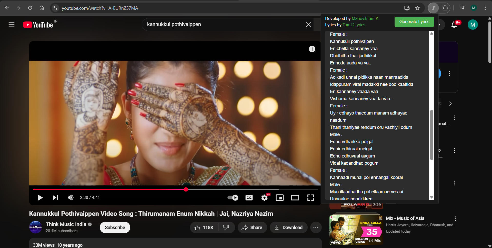

# 🎵 YouTube Tamil Lyrics Fetcher

**A Chrome extension that fetches Tamil song lyrics from [tamil2lyrics.com](https://tamil2lyrics.com) while you're watching music videos on YouTube.**

---

## 🚀 Features

- 🔍 Automatically detects Tamil songs on YouTube.
- 📄 Fetches lyrics from tamil2lyrics.com.
- 💬 Displays lyrics in a clean, readable popup.
- 🧠 Simple, lightweight, and easy to use.

---

## 🖼️ Preview



---

## 📦 Installation

### 🔧 Chrome Extension Setup

1. Clone or download this repository:

   ```bash
   git clone https://github.com/manov-ik/youtube-tamil2lyrics-extension-v1.git
   ```

2. Open Chrome and go to `chrome://extensions/`.
3. Enable **Developer mode** (top-right corner).
4. Click **Load unpacked** and select the extension directory.

---

## 🖥️ Backend Server Setup

### 🔨 Run Locally

1. Install Python dependencies:

   ```bash
   pip install -r requirements.txt
   ```

2. Start the server:

   ```bash
   python app.py
   ```

### 🌐 Deploy to the Web (Recommended)

You can deploy the server online to avoid running it locally every time:

- Fork and clone the backend server repo:
  👉 [lyrics-extension-backend](https://github.com/manov-ik/lyrics-extension-backend)

- Deploy it on a platform like [Render](https://render.com).

- After deployment, update:

  - `popup.js` – with your backend URL
  - `manifest.json` – add your deployed backend URL under `"host_permissions"`

---

## 🔧 Usage

1. Open YouTube and play a Tamil song.
2. The extension will automatically try to match the video title with lyrics from tamil2lyrics.com.
3. Lyrics will be shown in the popup.

---

## 🛠️ Tech Stack

- 🧱 HTML, CSS, JavaScript
- 🌐 Chrome Extensions API
- 🕸️ Python (Flask) for backend
- 🔍 Web scraping/API to fetch lyrics

---

## 🧩 Required Permissions

| Permission                   | Purpose                                  |
| ---------------------------- | ---------------------------------------- |
| `tabs`                       | To access the current YouTube video URL  |
| `https://www.youtube.com/*`  | To detect when a YouTube video is played |
| `https://tamil2lyrics.com/*` | To fetch lyrics from the website         |

---

## 🐞 Known Issues

- Not all video titles may match lyrics perfectly.
- Songs unavailable on tamil2lyrics.com won’t show lyrics.

---

## 📄 License

This project is licensed under the **MIT License**.
See the [LICENSE](LICENSE.md) file for more details.

---

## 🙏 Acknowledgements

- 💖 Thanks to [tamil2lyrics.com](https://tamil2lyrics.com) for maintaining a great Tamil lyrics collection.
- 📺 Thanks to YouTube for being the go-to platform for music lovers worldwide.
